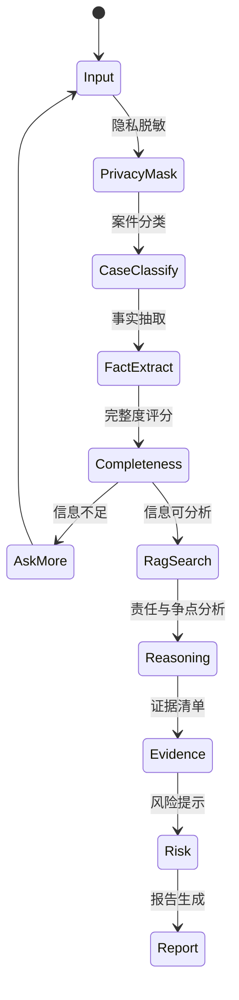

# 法律责任初步分析 Agent

## 项目简介

本项目是 CS599《企业级应用软件设计与开发》期末大作业，方向选择为 **方向一：Agentic AI 原生开发**。

系统面向普通用户的高频民事法律咨询场景，提供“法律权益维护辅助 Agent”：用户用自然语言描述劳动纠纷、房屋租赁、民间借贷、消费维权等问题后，Agent 会完成隐私脱敏、案件分类、事实抽取、缺失信息追问、争点分析、证据清单、维权路径、风险提示和 Markdown 报告生成。

> 所有输出均为“仅供初步参考，不构成正式法律意见”；复杂、高风险或重大金额案件建议咨询专业律师。

## 方向

- 课程方向：方向一，Agentic AI 原生开发。
- 项目类型：垂直领域法律责任初步分析 Agent。
- 核心价值：把“固定模板回答”升级为“基于事实、争点、证据和规则的动态分析闭环”。
- 目标用户：缺少法律知识、需要先整理事实和维权路径的普通用户。

## 技术栈

| 类别 | 技术 |
| --- | --- |
| 后端 | Java 21, Spring Boot 3, Spring Security, MyBatis-Plus |
| 数据 | PostgreSQL, pgvector, Redis |
| 前端 | Vue 3, Vite, TypeScript, Pinia, Element Plus |
| Agent | 规则编排 + LLM Provider 适配 + 轻量 RAG 检索预留 |
| 协议 | REST API, SSE 流式输出, JWT |
| 工程化 | Docker Compose, Maven, npm scripts |

## 目录结构

```text
cs599-project/
├── backend/                  # Spring Boot API 与 Agent 服务
├── frontend/                 # Vue 3 前端
├── demo/                     # 本地演示脚本与轻量 Demo 服务
├── docs/
│   ├── CS599_大作业报告.md   # 最终报告源文件
│   ├── CS599_大作业报告.pdf  # 最终报告 PDF
│   ├── architecture.md       # 架构与 Agent 流程说明
│   ├── spec.md               # Product / API / SDD 规格
│   └── demo.md               # 演示脚本与测试记录
├── docker-compose.yml        # 一键启动 PostgreSQL/Redis/后端/前端
├── .env.example              # 环境变量样例，不包含密钥
├── .gitignore
├── LICENSE
└── README.md
```

## 核心功能

- 用户认证：注册、登录、JWT 鉴权、基础角色预留。
- 法律咨询会话：创建会话、保存消息、历史会话列表。
- SSE 流式回复：聊天页以流式方式展示 Agent 回答。
- Agent 分析闭环：案件分类、事实抽取、完整度评分、追问、争点分析、证据评估、行动路径和风险提示。
- RAG 预留与轻量检索：数据库内置法律条文和案例种子数据，表结构预留 `vector(1536)`，服务层提供 `RagSearchService`。
- 报告生成：基于最新结构化分析生成《法律责任初步分析报告》Markdown 下载。
- 文件上传占位：记录文件元数据，预留 OCR/PDF/Word 解析能力。
- 后台管理占位：预留法律知识、案例和 Prompt 模板管理接口。

## Agent 状态流



## 环境变量

复制 `.env.example` 后按需设置环境变量。不要把真实 API Key 提交到仓库。

| 变量 | 默认值 | 说明 |
| --- | --- | --- |
| `DB_URL` | `jdbc:postgresql://localhost:5432/law_agent` | PostgreSQL 连接 |
| `DB_USER` | `law_agent` | 数据库用户 |
| `DB_PASSWORD` | `law_agent` | 数据库密码 |
| `REDIS_HOST` | `localhost` | Redis 主机 |
| `JWT_SECRET` | `change-me-change-me-change-me-change-me-32` | JWT 签名密钥 |
| `LLM_PROVIDER` | `mock` | `mock`、`openai`、`deepseek`、`qwen` 等 |
| `LLM_API_KEY` | 空 | 真实模型 API Key |
| `LLM_BASE_URL` | 空 | 兼容 OpenAI 风格接口的 Base URL |
| `LLM_MODEL` | `gpt-4o-mini` | 模型名 |

## Docker 启动

```powershell
docker compose up
```

启动后访问：

- 前端：`http://localhost:5173`
- 后端：`http://localhost:8080`
- PostgreSQL：`localhost:5432`
- Redis：`localhost:6379`

## 本地启动

后端：

```powershell
cd backend
mvn spring-boot:run
```

前端：

```powershell
cd frontend
npm install
npm run dev
```

## 轻量 Demo

如果本机没有完整 Java/PostgreSQL 环境，可运行 `demo/run-demo.ps1` 启动轻量演示服务：

```powershell
.\demo\run-demo.ps1
```

访问 `http://localhost:5173`，按 `docs/demo.md` 中的演示脚本输入案例。

## API 摘要

| 模块 | 接口 |
| --- | --- |
| Auth | `POST /api/auth/register`, `POST /api/auth/login` |
| 会话 | `POST /api/legal-sessions`, `GET /api/legal-sessions`, `PATCH /api/legal-sessions/{id}` |
| 聊天 | `POST /api/chat/messages`, `GET /api/chat/stream/{sessionId}` |
| 分析 | `GET /api/case-analyses/{sessionId}` |
| 报告 | `POST /api/reports/{sessionId}`, `GET /api/reports/{id}/download` |
| 知识库 | `GET /api/legal-articles/{id}`, `GET /api/legal-cases/similar` |
| 管理 | `GET|POST|PUT /api/admin/prompt-templates` |

完整接口说明见 `docs/spec.md` 和 `docs/api.md`。

## Demo 流程

1. 注册或登录测试用户。
2. 创建法律咨询会话。
3. 输入劳动纠纷案例：`公司拖欠工资三个月且未签劳动合同，我有工资流水和工作群聊天记录。`
4. 查看 Agent 的流式回复、追问、争点分析、证据建议和风险提示。
5. 输入民间借贷案例：`朋友借钱2万元不还，没有借条但有微信聊天和银行转账记录。`
6. 生成并下载 Markdown 报告。

## 测试与评估

```powershell
cd backend
mvn test
```

```powershell
cd frontend
npm install
npm run build
```

测试重点：

- 劳动纠纷分类、缺失信息追问、免责声明。
- 民间借贷中“无借条但有转账”的证据评估。
- 前端登录、会话、报告页面构建。
- Docker Compose 一键部署与 Demo 可访问性。

## 项目状态

- [x] Proposal：选题、设计思想、技术路线已完成。
- [x] MVP：前后端骨架、Agent 规则分析、SSE、报告生成已完成。
- [x] Final：README、报告源文件、架构文档、规格文档、Demo 文档、环境样例已补齐。
- [ ] Final PDF：提交前确认姓名、学号已替换，并重新导出 `docs/CS599_大作业报告.pdf`。

## 学术纪律与安全边界

- 仓库不提交任何真实 API Key、Token、个人敏感信息或 `.env`。
- 引用外部代码、工具或 AI 辅助内容时，在报告中明确说明。
- Agent 不承诺胜诉，不指导伪造证据，不替代律师正式法律意见。
- 身份证、手机号、银行卡等敏感信息在进入 Agent 分析前进行脱敏。

## License

本项目使用 MIT License。若课程要求使用其他协议，可在提交前替换 `LICENSE`。
