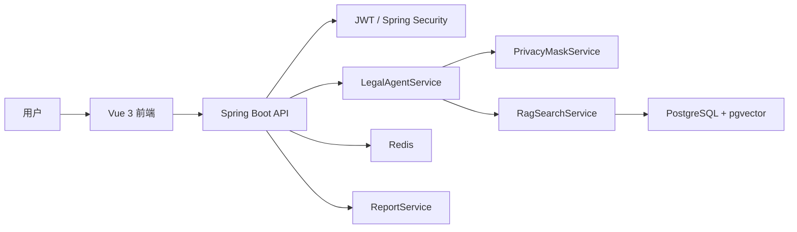
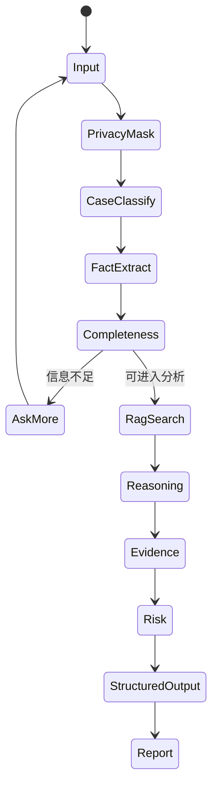

# CS599 期末大作业报告

| 字段 | 内容 |
| --- | --- |
| 课程名称 | 企业级应用软件设计与开发 |
| 项目名称 | 法律责任初步分析 Agent |
| 方向 | 方向一：Agentic AI 原生开发 |
| 学号 | 2025302937 |
| 姓名 | 宋怡康 |
| 专业 | 计算机技术 / 软件工程 |
| 指导教师 | 威欣 |
| 提交日期 | 2026 年 6 月 22 日 |

## 目录

- 摘要
- 一、选题背景与设计思想
- 二、Specs 规格设计
- 三、系统架构与设计
- 四、关键实现与代码展示
- 五、测试与评估
- 六、系统升级与扩展
- 七、课程总结
- 附录：运行方式

## 摘要

本项目构建了一个面向普通用户的法律责任初步分析 Agent。系统聚焦劳动纠纷、房屋租赁、民间借贷和消费维权等高频民事场景，提供从自然语言咨询到结构化法律分析再到 Markdown 报告生成的完整闭环。后端采用 Java 21 和 Spring Boot，前端采用 Vue 3 和 TypeScript，数据层使用 PostgreSQL、pgvector 和 Redis。Agent 当前以规则编排实现可解释的 MVP，同时预留 LLM Provider、Prompt 模板、向量检索和模型调用日志等扩展点。

与普通聊天机器人不同，本系统强调“可追问、可解释、可沉淀”。用户的每一轮补充信息都会进入同一个会话上下文，Agent 根据新增事实重新评估事实完整度、请求成熟度和证据强度，并把最终分析沉淀为结构化面板和报告。这种设计更适合企业级应用软件课程中要求的 Agentic AI 开发方式：不是只生成一段回答，而是围绕业务对象、状态转移、工具调用和交付物形成完整产品。

项目最终形成了前端、后端、数据层、Agent 编排和报告文档的完整工程包。前端负责多轮交互和结构化可视化，后端负责认证、会话、消息、分析和报告生成，数据层保存用户、会话、法条、类案、分析结果和报告。Agent 部分以可解释规则为主，同时保留 LLM Provider、Prompt 模板和向量检索扩展点，使系统既能在无外部模型环境下稳定演示，也能在后续接入真实大模型后继续演进。

## 一、选题背景与设计思想

普通用户遇到法律争议时，往往无法区分“事实是否完整”“证据是否足够”“应该先投诉、仲裁还是起诉”。直接让大模型回答“能不能赢”容易产生过度确定、忽略证据链和法律边界的问题。因此，本项目把目标定义为法律权益维护辅助，而不是 AI 法官或 AI 律师。

系统的设计思想是把用户描述拆解为一条 Agent 工作链路：用户描述 -> 隐私脱敏 -> 案件分类 -> 事实抽取 -> 完整度判断 -> RAG 检索 -> 责任分析 -> 证据建议 -> 风险提示 -> 报告生成。Agent 优先帮助用户补齐事实和证据，再输出初步分析，所有结果都带有免责声明和风险提示。

项目价值主要体现在三点：第一，降低普通用户整理法律材料的门槛；第二，把法律分析从模板问答升级为结构化、多步骤、可解释的 Agent 流程；第三，为后续接入真实 LLM、Agentic RAG、OCR 证据抽取和律师转接留下工程接口。

选题时我重点考虑了两个约束。第一，法律场景属于高风险信息服务，不能只追求回答流畅，而必须把不确定性、证据不足和安全边界放在产品核心位置。第二，课程要求强调企业级应用软件设计与 Agentic AI，因此项目不能停留在一个单文件 Demo，而应有登录认证、数据持久化、API 设计、前端状态管理、部署脚本和测试用例。最终选择法律责任初步分析，是因为它既有真实应用价值，又天然适合用 Agent 的多步骤推理来表达。

在具体设计上，我没有把系统设计成“法律问答百科”，而是设计成“案件整理助手”。二者差异在于，百科式问答通常围绕一个问题输出知识解释，而案件整理助手需要持续追问事实、判断证据链强弱、提示维权路径，并在最后形成一份可复核的材料。这个定位也决定了系统必须支持会话状态、结构化结果、证据清单和报告生成，而不是只展示一段大模型文本。

项目的核心原则包括四点：事实优先，所有判断都围绕用户已经提供的事实；证据优先，优先提醒用户补强工资流水、聊天记录、合同、订单等证据；边界优先，不承诺胜诉、不输出正式法律意见；可扩展优先，把分类、抽取、检索、推理和报告生成拆成可替换模块，为后续 LLM 和 RAG 升级留下空间。

## 二、Specs 规格设计

### 2.1 Product Spec

系统服务对象为普通民事争议用户，核心功能包括账号登录、法律咨询会话、SSE 流式回复、结构化案件分析、法条/类案检索、证据建议、风险提示和报告生成。

从产品角度看，系统把用户咨询拆成三个层次：第一层是面向用户的自然语言交互，保证用户可以像描述真实经历一样输入材料；第二层是面向 Agent 的结构化中间状态，包括案件类型、事实字段、证据线索、争点和风险；第三层是面向交付的报告和后续维权路径，让用户可以把咨询结果带到劳动监察、仲裁、平台投诉或律师沟通场景中继续使用。

用户故事可以概括为：用户登录系统后创建一个法律咨询会话，输入“公司拖欠工资三个月且未签劳动合同”一类自然语言描述；系统先给出初步结论和缺失信息追问；用户继续补充工资标准、欠薪月份、考勤和工资流水等事实；Agent 重新计算事实完整度并更新争点、证据强度和维权路径；最后用户点击“生成报告”，获得一份可下载的案件分析材料。这个流程覆盖了课程要求中的 Agent 交互、工具调用、结构化输出和最终交付。

为了保证 MVP 范围可控，系统先聚焦四类高频民事场景，而没有泛化到全部法律领域。这四类案件共同特点是：事实要素相对稳定、证据类型可枚举、普通用户需求高、适合通过多轮追问提升材料完整度。例如劳动纠纷关注入职时间、工资标准、欠薪月份、劳动关系证据；民间借贷关注借款金额、交付方式、还款期限、借贷合意和对方身份。通过这种领域限定，系统可以在课程周期内做出较完整的端到端体验。

当前支持四类场景：

| 场景 | 子问题示例 | Agent 输出重点 |
| --- | --- | --- |
| 劳动纠纷 | 欠薪、未签合同、辞退 | 劳动关系、工资标准、仲裁时效、劳动证据 |
| 房屋租赁 | 押金不退、提前退租、维修 | 合同条款、押金金额、交接记录、扣款依据 |
| 民间借贷 | 无借条、转账、利息 | 借贷合意、款项交付、身份信息、还款期限 |
| 消费维权 | 质量问题、虚假宣传、退款 | 订单支付、瑕疵证据、售后记录、投诉路径 |

### 2.2 API Spec

系统采用 REST API 和 SSE。核心接口包括：

| 模块 | 接口 |
| --- | --- |
| Auth | `POST /api/auth/register`, `POST /api/auth/login` |
| 会话 | `POST /api/legal-sessions`, `GET /api/legal-sessions` |
| 聊天 | `POST /api/chat/messages`, `GET /api/chat/stream/{sessionId}` |
| 分析 | `GET /api/case-analyses/{sessionId}` |
| 报告 | `POST /api/reports/{sessionId}`, `GET /api/reports/{id}/download` |
| 知识库 | `GET /api/legal-articles/{id}`, `GET /api/legal-cases/similar` |

统一响应格式为：

```json
{ "code": 0, "message": "ok", "data": {} }
```

API 设计遵循前后端分离和职责清晰原则。认证接口只负责用户身份和 token，法律会话接口只负责会话生命周期，聊天接口负责消息写入和流式回复，分析接口负责查询最新结构化结果，报告接口负责把分析结果固化为 Markdown 报告。这样的划分避免了一个接口承担过多职责，也方便后续为移动端、后台管理端或第三方集成提供相同能力。

SSE 被用于聊天回复流式展示。相较于普通 HTTP 一次性返回，SSE 可以让前端更接近真实 Agent 交互体验：用户提交后可以看到系统逐步返回分析内容，而不是长时间等待。对于法律咨询场景，流式输出还能降低等待焦虑，使“初步结论、为什么、还需确认、下一步”这些结构逐段呈现。

错误处理方面，接口统一使用 `code`、`message`、`data` 的响应格式。业务错误例如参数缺失、资源不存在、未登录、权限不足，会分别映射为明确的状态码和错误信息。统一响应格式的好处是前端可以用一套拦截器处理登录失效、提示错误和更新页面状态，降低重复代码。

### 2.3 SDD 核心

Agent 输出对象包含案件类型、子类型、诉求目标、完整度评分、结论等级、事实、缺失问题、争点、证据评估、行动路径、风险、引用来源和用户回复。这种结构化设计让前端展示、报告生成和自动化测试复用同一份结果。

结构化输出还承担了“防幻觉”的作用。系统不会直接把模型自然语言回复当作唯一结果，而是把关键判断拆成可检查字段：哪些事实已经确认、哪些证据已经出现、哪些请求目前可主张、哪些事项仍需补充。前端分析面板、报告生成和测试断言都围绕这些字段工作，从而降低回答漂移和不可验证输出的风险。

从软件设计文档角度看，`AgentResult` 是系统最重要的数据契约。它既是 Agent 内部推理的终点，也是前端分析面板、报告服务和自动化测试的输入。只要这个契约稳定，后续无论把内部节点换成规则、LLM Function Calling 还是 LangGraph 风格状态机，外部模块都不需要大改。这体现了企业级应用中“内部实现可演进、外部接口保持稳定”的设计思路。

结论等级采用 `needs_more_facts`、`preliminary_possible`、`preliminary_supported` 等分级，而不是简单输出“能”或“不能”。这样做的原因是法律问题通常依赖证据和程序条件，过早给出确定结论容易误导用户。结论等级可以把系统的信心和事实完整度显式表达出来，让用户知道当前回答是“需要补充事实”“有初步方向”还是“现有材料较支持”。

## 三、系统架构与设计

### 3.1 总体架构




整体架构采用前端、API、Agent 服务、数据存储四层划分。前端只关心页面交互和状态展示，不直接处理法律规则；API 层负责鉴权、会话、消息、报告等业务入口；Agent 服务层负责具体分析逻辑；数据层负责持久化用户、会话、消息、知识库和分析结果。这种分层可以让项目在规模变大时保持清晰边界，例如后续要替换前端框架或接入新的模型服务时，不需要重写数据库结构和核心业务接口。

后端选择 Spring Boot 是因为它适合构建课程要求中的企业级应用：依赖管理成熟，安全、配置、测试、Web API、数据库访问都有稳定生态。前端选择 Vue 3 和 Element Plus，是因为它能快速构建管理后台式界面，适合展示会话列表、聊天窗口、分析面板、报告按钮等业务组件。数据层使用 PostgreSQL 是为了保证结构化数据可靠存储，预留 pgvector 则用于后续把法条和案例升级为向量检索。

Redis 在当前 MVP 中主要作为企业级架构预留，用于后续缓存会话状态、限流、任务队列或模型调用中间结果。虽然当前项目规模不大，但在架构图和配置中保留 Redis，体现了系统向生产环境演进时对性能和状态管理的考虑。

### 3.2 Agent 交互流程




Agent 交互流程体现了“状态驱动”的设计。用户输入不是直接交给模型生成答案，而是先进入脱敏和分类，再根据案件类型套用不同的事实字段和证据规则。事实完整度不足时，系统会优先生成追问；事实达到最低分析阈值后，才进入 RAG 检索、争点推理、证据评估和风险提示。这个流程可以避免用户只输入一句模糊描述时系统过度推断。

流程中最关键的节点是完整度判断。不同案件类型的必要事实不同，例如劳动纠纷需要入职时间、用人单位、工资标准、欠薪期间和劳动关系证据；民间借贷需要借款金额、交付方式、还款期限、借贷合意和对方身份。系统通过必备事实字段计算完整度，并决定是追问还是继续分析。这样 Agent 的行为不只是“看起来会聊天”，而是真正受业务规则约束。

RAG 检索节点目前采用轻量实现，但在架构上已经承担了来源约束作用。系统会从法条和类案种子数据中召回候选来源，并把来源写入结构化结果。后续接入 embedding 后，可以把这个节点升级为关键词召回、向量召回、重排和引用校验的组合流程，使法律分析更具可追溯性。

### 3.3 数据设计

数据库表包括用户、会话、消息、案件分析、法条、类案、报告、文件、Prompt 模板、模型调用日志和脱敏日志。`legal_articles`、`legal_cases` 和 `legal_documents` 均预留 `embedding vector(1536)` 字段，为后续向量检索和 Agentic RAG 做准备。

数据设计围绕两个目标展开：一是支持用户会话长期保存，二是支持 Agent 分析结果可复用。`legal_sessions` 和 `chat_messages` 保存会话与消息，保证用户可以回到历史咨询继续补充事实；`case_analyses` 保存最新结构化分析结果，让前端分析面板和报告服务不需要重新解析聊天文本；`analysis_reports` 保存生成后的报告内容，保证交付物可下载、可归档。

知识库相关表分为法条、类案和文档切片三类。法条表适合保存具有明确来源和有效性的法律条文，类案表适合保存相似案件摘要，文档切片表则预留给后续更大规模的知识库导入。三类表都保留 `source_url` 或 `metadata`，是为了让系统在引用时能够说明来源，而不是只给出没有出处的法律观点。

Prompt 模板、模型调用日志和脱敏日志目前属于预留能力，但它们对企业级 Agent 很重要。Prompt 模板可以让管理员迭代不同节点的提示词；模型调用日志可以记录 provider、token、延迟和错误，便于成本和质量评估；脱敏日志可以在不保存原始敏感信息的前提下支持审计和问题排查。

## 四、关键实现与代码展示

### 4.1 LegalAgentService

`LegalAgentService` 是核心 Agent 编排服务。它接收用户文本后，依次完成脱敏、案件识别、事实抽取、完整度计算、追问生成、争点分析、证据评估、RAG 检索、行动路径和风险提示，最终返回 `AgentResult`。

关键实现特点：

- 通过关键词和规则识别劳动纠纷、房屋租赁、民间借贷、消费维权。
- 每类案件配置不同的必要事实和证据规则。
- 使用完整度评分控制“先追问还是先分析”。
- 输出 `needs_more_facts`、`preliminary_possible`、`preliminary_supported` 等结论等级。
- 在回复中统一加入“仅供初步参考，不构成正式法律意见”。

在实现上，`LegalAgentService` 并不是简单的 if-else 问答模板，而是把案件处理拆成多个内部步骤。第一步根据关键词识别案件大类和子类型；第二步从文本中抽取金额、日期、地点、合同、聊天记录、支付记录、照片视频等事实线索；第三步根据不同案件类型的必要字段计算完整度；第四步生成缺失问题；第五步基于案件类型生成争点、证据清单、行动路径和风险提示。每一步都有明确输入和输出，便于单元测试和后续替换。

以劳动纠纷为例，系统会关注“是否能够证明劳动关系”“拖欠工资责任”“未签书面劳动合同责任”“仲裁时效和程序前置风险”等争点。对于每个争点，系统会分别整理已知事实、缺失事实、法律规则、事实适用和初步结论。这样的结构接近法律分析中的“规则、事实、适用、结论”框架，比直接输出一段建议更容易检查和复用。

规则实现还有一个优点：即使没有外部大模型 API Key，系统仍然可以稳定完成课堂演示。这对课程项目很重要，因为答辩或验收环境可能没有可用网络或模型额度。后续如果需要增强表达能力，可以只把分类、事实抽取或推理节点替换成 LLM 调用，而不必推翻整体系统。

### 4.2 RAG 与知识库

`RagSearchService` 从法条和类案表中检索候选来源。当前 MVP 使用轻量关键词检索保证可离线运行，数据库 schema 预留 pgvector 字段，后续可升级为 embedding 召回、重排和来源约束生成。

当前知识库中预置了劳动合同法、劳动争议调解仲裁法、民法典合同编、消费者权益保护法等基础材料，以及劳动纠纷、租赁纠纷、民间借贷、消费维权的示例案例。虽然数据规模不大，但足以展示 RAG 的基本思想：Agent 不仅依赖内部规则，还可以把检索到的法条和类案作为参考来源加入回复和报告。

RAG 节点在当前版本中承担三个职责。第一是根据案件类型缩小检索范围，避免劳动纠纷引用消费维权材料；第二是把来源标题和 URL 写入 `citations`，便于报告中展示参考依据；第三是为后续 embedding 检索提供结构化表和服务接口。后续如果引入向量模型，只需要为 `legal_articles` 和 `legal_cases` 写入 embedding，再扩展检索排序逻辑。

为了避免来源滥用，系统设计上要求 RAG 结果只是“参考来源”，不能把检索结果直接等同于最终法律结论。Agent 仍需结合用户事实和证据强度进行判断。当检索不到可靠来源时，系统可以输出一般性提示，但应降低结论强度，并提醒用户咨询专业律师。

### 4.3 前端交互

前端使用 Vue 3、Pinia 和 Element Plus。用户登录后进入聊天页面，系统通过 SSE 展示流式 Agent 回复，并在结构化分析面板中展示案件类型、缺失问题、证据、风险和引用来源。报告页面调用后端接口生成 Markdown 报告。


实际界面采用三栏结构：左侧是法律咨询会话列表，中间是多轮对话窗口，右侧是实时案件分析面板。中间对话区展示 Agent 的初步结论、原因说明、仍需确认的信息和下一步建议；右侧面板同步展示案件分类、诉求目标、请求成熟度、缺失信息、争点分析和参考依据。用户每补充一次事实，Agent 都会重新整理上下文，使输出从“泛泛建议”逐步收敛为“围绕本案事实和证据的可操作分析”。

界面右上角提供在线生成报告入口。该按钮不是简单截图导出，而是调用后端报告服务，基于最新的 `case_analyses` 结构化结果生成 Markdown 报告。这样可以保证报告内容与 Agent 面板中的案件类型、证据强度、风险提示保持一致，也方便后续扩展为 PDF/Docx 导出。

前端状态管理使用 Pinia，把认证状态和聊天状态拆分到不同 store 中。认证 store 维护 token 和用户信息，聊天 store 维护会话列表、当前会话、消息流和分析结果。这样做可以避免组件之间直接传递大量 props，也让登录状态失效、切换会话、追加 SSE 消息等操作更容易维护。

页面交互上，系统提供了快捷输入标签，例如“欠薪未签合同”“借钱不还”“押金不退”“消费退款”等，帮助演示时快速触发典型案例。输入框支持用户继续补充事实，右侧面板则展示最新结构化结果。这个设计能体现 Agent 的多轮能力：不是一轮问答结束，而是随着事实补充持续更新分析。

报告生成功能体现了“从交互到交付”的闭环。普通聊天系统往往停留在屏幕上的回答，而本项目将回答沉淀为报告记录，便于下载、复核和课堂展示。报告服务复用后端分析结果，而不是重新让前端拼接文本，因此格式更稳定，也更适合后续生成 PDF 或 Docx。

### 4.4 安全边界

系统实现了隐私脱敏服务，避免身份证、手机号、银行卡等敏感信息直接进入分析链路。Agent 回复不承诺胜诉、不指导伪造证据，并对高风险情况提示咨询专业律师。

安全边界在本项目中不是单独的提示语，而是贯穿整个执行链路：输入阶段先做隐私脱敏，分析阶段根据事实完整度控制结论强度，输出阶段统一加入免责声明和风险提示，报告阶段保留“仅供初步参考”的定位。对于劳动仲裁时效、对方失联、证据灭失、金额较大等场景，系统会提示用户尽快固定证据或咨询律师，而不是给出绝对结论。

隐私保护方面，系统会在进入 Agent 分析前处理手机号、身份证号、银行卡号等敏感信息。这样即使后续接入外部 LLM，也可以减少敏感数据直接暴露给第三方模型的风险。当前版本还预留了脱敏日志表，可以记录脱敏类型和哈希摘要，而不保存原始敏感内容。

合规输出方面，系统避免三类危险回答：第一是不承诺“肯定胜诉”或“必然赔偿”；第二是不建议伪造、篡改、隐瞒证据；第三是不指导用户绕开法律程序。对于复杂或高风险案件，系统会将结论保持在初步分析层面，并建议用户找专业律师进一步确认。

## 五、测试与评估

### 5.1 功能测试

后端测试覆盖两个核心 Demo：

- 劳动纠纷：输入“公司拖欠工资三个月且未签劳动合同”，系统应识别为劳动纠纷，生成缺失问题，并包含免责声明和争点分析。
- 民间借贷：输入“朋友借钱2万元不还，没有借条但有微信聊天和银行转账记录”，系统应识别为民间借贷纠纷，发现借贷合意争点，并区分转账记录和借条证据状态。

测试设计重点不是覆盖所有法律情形，而是验证 Agent 的关键行为是否稳定。劳动纠纷用例验证案件分类、子类型识别、缺失问题生成和免责声明；民间借贷用例验证不同案件类型下的争点切换和证据强度判断。只要这两类代表性用例通过，就说明核心 Agent 编排没有退化为单一模板输出。

后续测试可以继续扩展四类场景的边界样本。例如劳动纠纷中加入“公司说已经结清”“员工主动离职”等对方抗辩；民间借贷中加入“对方说是赠与”“已经部分还款”；租赁纠纷中加入“提前退租”和“房东扣维修费”；消费维权中加入“超过售后期”和“商家主张人为损坏”。这些样本可以检验 Agent 是否能识别不利因素和风险。

### 5.2 构建测试

后端通过 Maven 测试验证核心服务。前端通过 `npm run build` 验证 TypeScript、路由、状态管理和页面组件无编译错误。

构建测试用于保证项目可以被助教或同学拉取后复现。后端依赖 Java 21 和 Maven，前端依赖 Node.js 和 npm。Docker Compose 则提供更统一的启动方式，将 PostgreSQL、Redis、后端和前端一起编排。由于课程验收环境可能不同，README 同时提供了 Docker 启动、本地启动和轻量 Demo 三种路径，降低复现门槛。

在当前开发环境中，部分联网依赖下载可能受网络影响，因此报告和 README 都保留了可离线演示路径。`demo/run-demo.ps1` 可以启动轻量版前后端服务，用于展示核心交互。完整版本则通过 Spring Boot、PostgreSQL 和 Redis 运行，体现企业级应用结构。

### 5.3 Demo 评估

课堂演示按以下路径完成：注册登录 -> 创建会话 -> 输入劳动纠纷案例 -> 查看流式回复 -> 查看结构化分析 -> 输入民间借贷案例 -> 生成报告。评估指标包括案件识别正确性、缺失问题有效性、证据建议可操作性、风险提示完整性和报告可读性。

以劳动纠纷案例为例，用户首先输入“公司拖欠工资三个月且未签劳动合同，我有工资转账记录和考勤打卡”。系统会识别为劳动纠纷，并给出初步判断：工资转账和考勤能够证明劳动关系与欠薪线索，但仍需补充入职时间、欠薪起止月份、实际工作地和是否在职等关键信息。当用户继续补充“每月 2000 元，欠薪 2 月至 6 月，最近一次催要工资时间是 6 月 15 日”后，Agent 会把请求成熟度更新为更高等级，并进一步输出拖欠工资金额、未签书面劳动合同责任、仲裁时效和证据清单。

这个 Demo 能体现 Agentic AI 的几个关键点：第一，系统不是一次性问答，而是多轮状态更新；第二，右侧分析面板不是装饰性摘要，而是由后端结构化分析结果驱动；第三，在线报告生成基于最新会话状态，能够把聊天过程沉淀为可提交、可复核的材料；第四，安全提示和不确定性说明始终保留，避免把初步分析误导为正式法律意见。

Demo 评估可以从定性和定量两个角度进行。定性上，观察系统是否能给出用户看得懂的追问、证据建议和下一步路径；定量上，可以记录案件分类是否正确、缺失问题是否覆盖关键事实、证据建议是否命中用户已提供材料、报告是否包含案件类型、争点、证据、风险和参考来源。对于课程大作业而言，这些指标比单纯追求模型回答华丽更重要。

与课程要求对应，本项目在测试评估章节中展示了功能测试、Agent 行为评估、Demo 截图和报告生成结果。虽然目前还没有完整的 LLMOps 平台，但数据表和服务设计已经为后续记录模型调用、延迟、错误和评估分数预留位置。

## 六、系统升级与扩展

下一阶段可以从四个方向升级：

1. 接入真实 LLM：将案件分类、事实抽取、法律推理等节点替换为 Function Calling 或结构化输出。
2. 增强 Agentic RAG：接入 embedding，使用 pgvector 做向量召回，并增加来源重排和引用约束。
3. 文件证据解析：接入 OCR、PDF/Word 解析，自动从工资流水、聊天截图、合同中抽取证据要素。
4. 可观测与评估：记录模型调用日志、延迟、错误、token 消耗和人工评分，形成 LLMOps 评估闭环。

如果继续推进到生产级版本，还需要增加三类能力。第一是知识库治理能力，包括法条有效性、案例来源可信度、知识入库审核和过期内容下线；第二是 Agent 评估能力，包括不同案件类型的 Benchmark、人工标注样本和自动回归测试；第三是交付能力，包括报告模板配置、PDF/Docx 导出、证据附件索引和律师协作入口。这些能力会让系统从课程 MVP 进一步接近真实企业级应用。

技术演进路线可以分为三个阶段。第一阶段是当前 MVP，目标是完成全栈闭环和规则 Agent，保证可运行、可解释、可展示。第二阶段接入真实 LLM，把事实抽取、追问生成和法律推理改为结构化模型调用，同时保留规则校验和安全审查。第三阶段引入 Agentic RAG、证据文件解析和 LLMOps 评估，让系统能够处理更多材料来源，并用数据持续评估回答质量。

产品演进路线则可以围绕“用户材料管理”展开。当前系统主要处理文本描述，后续可以让用户上传合同、工资流水、聊天截图、订单截图和催告记录，由 OCR 和文档解析节点抽取证据要素，并在报告中形成附件索引。这样系统不只是回答问题，还能帮助用户组织维权材料包。

部署演进方面，当前 Docker Compose 适合本地和课程展示。若进入真实环境，可以拆分前端静态资源、后端 API、数据库、Redis、对象存储和模型代理服务，并增加 HTTPS、访问日志、备份策略、限流和权限审计。对于法律相关应用，还需要更加严格的数据安全和用户授权机制。

## 七、课程总结

通过本项目，我对企业级应用中的 Agentic AI 有了更具体的理解。Agent 不只是调用一次大模型，而是把任务拆分为多个有状态、有边界、可测试的节点，并用工程化方式处理身份认证、数据持久化、错误兜底、隐私保护、前后端交互和部署。

本项目仍有不足：当前法律推理主要依靠规则，真实 LLM 和向量检索尚未完全接入；文件证据解析只完成了接口占位；报告导出仍以 Markdown 为主。后续如果继续迭代，我会优先补齐 Agentic RAG、真实模型调用、证据解析和可观测评估，使系统从课程 MVP 进一步接近可用产品。

课程开发过程中最大的收获，是认识到 AI 应用开发不能只关注模型本身。一个可交付系统还需要清楚的产品边界、稳定的数据结构、可复现的部署方式、可解释的输出、可测试的业务逻辑和可维护的文档。尤其在法律场景中，回答是否“像真的”并不是最重要的，是否能说明依据、暴露不确定性、提示证据缺口和避免越界才是更关键的工程目标。

另一个收获是 SDD 和规格文档对实现有实际帮助。先定义 API、数据对象和 Agent 流程，再实现代码，可以减少后期返工。例如 `AgentResult` 的结构化设计让前端面板、报告生成和单元测试都能复用同一份数据；Docker 和 README 的启动说明则保证项目不仅能在开发者电脑上运行，也能被评阅者快速理解和复现。

如果给课程提出建议，我希望后续可以增加更多 Agent 评估样例和真实企业级案例，例如如何设计 Benchmark、如何比较规则 Agent 与 LLM Agent、如何记录模型调用成本、如何处理隐私和合规审计。这些内容与本项目后续演进方向高度相关，也能帮助学生从“能调用模型”进一步走向“能交付可靠 AI 软件”。

## 附录：运行方式

Docker 启动：

```powershell
docker compose up
```

后端测试：

```powershell
cd backend
mvn test
```

前端构建：

```powershell
cd frontend
npm install
npm run build
```

重新生成带书签和图片的 PDF：

```powershell
python scripts/generate-report-pdf.py
```

轻量演示：

```powershell
.\demo\run-demo.ps1
```
