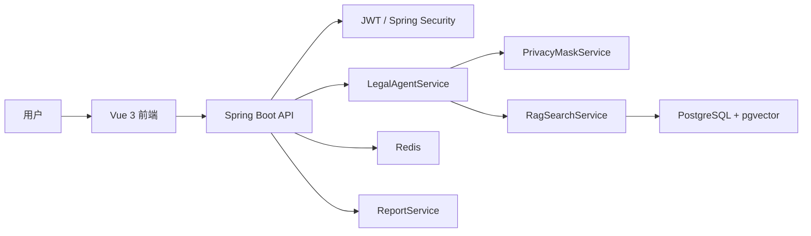
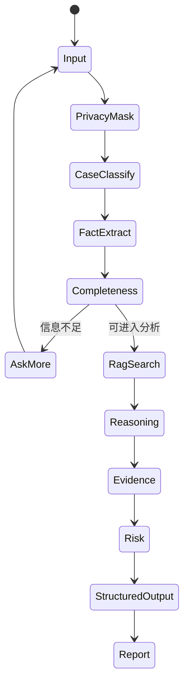

# CS599 期末大作业报告

| 字段 | 内容 |
| --- | --- |
| 课程名称 | 企业级应用软件设计与开发 |
| 项目名称 | 法律责任初步分析 Agent |
| 方向 | 方向一：Agentic AI 原生开发 |
| 学号 | 2025302937 |
| 姓名 | 宋怡康 |
| 专业 | 计算机技术 / 软件工程 |
| 指导教师 | 威欣 |
| 提交日期 | 2026 年 6 月 22 日 |

## 目录

- 摘要
- 一、选题背景与设计思想
- 二、Specs 规格设计
- 三、系统架构与设计
- 四、关键实现与代码展示
- 五、测试与评估
- 六、系统升级与扩展
- 七、课程总结
- 附录：运行方式

## 摘要

本项目构建了一个面向普通用户的法律责任初步分析 Agent。系统聚焦劳动纠纷、房屋租赁、民间借贷和消费维权等高频民事场景，提供从自然语言咨询到结构化法律分析再到 Markdown 报告生成的完整闭环。后端采用 Java 21 和 Spring Boot，前端采用 Vue 3 和 TypeScript，数据层使用 PostgreSQL、pgvector 和 Redis。Agent 当前以规则编排实现可解释的 MVP，同时预留 LLM Provider、Prompt 模板、向量检索和模型调用日志等扩展点。

## 一、选题背景与设计思想

普通用户遇到法律争议时，往往无法区分“事实是否完整”“证据是否足够”“应该先投诉、仲裁还是起诉”。直接让大模型回答“能不能赢”容易产生过度确定、忽略证据链和法律边界的问题。因此，本项目把目标定义为法律权益维护辅助，而不是 AI 法官或 AI 律师。

系统的设计思想是把用户描述拆解为一条 Agent 工作链路：用户描述 -> 隐私脱敏 -> 案件分类 -> 事实抽取 -> 完整度判断 -> RAG 检索 -> 责任分析 -> 证据建议 -> 风险提示 -> 报告生成。Agent 优先帮助用户补齐事实和证据，再输出初步分析，所有结果都带有免责声明和风险提示。

项目价值主要体现在三点：第一，降低普通用户整理法律材料的门槛；第二，把法律分析从模板问答升级为结构化、多步骤、可解释的 Agent 流程；第三，为后续接入真实 LLM、Agentic RAG、OCR 证据抽取和律师转接留下工程接口。

## 二、Specs 规格设计

### 2.1 Product Spec

系统服务对象为普通民事争议用户，核心功能包括账号登录、法律咨询会话、SSE 流式回复、结构化案件分析、法条/类案检索、证据建议、风险提示和报告生成。

当前支持四类场景：

| 场景 | 子问题示例 | Agent 输出重点 |
| --- | --- | --- |
| 劳动纠纷 | 欠薪、未签合同、辞退 | 劳动关系、工资标准、仲裁时效、劳动证据 |
| 房屋租赁 | 押金不退、提前退租、维修 | 合同条款、押金金额、交接记录、扣款依据 |
| 民间借贷 | 无借条、转账、利息 | 借贷合意、款项交付、身份信息、还款期限 |
| 消费维权 | 质量问题、虚假宣传、退款 | 订单支付、瑕疵证据、售后记录、投诉路径 |

### 2.2 API Spec

系统采用 REST API 和 SSE。核心接口包括：

| 模块 | 接口 |
| --- | --- |
| Auth | `POST /api/auth/register`, `POST /api/auth/login` |
| 会话 | `POST /api/legal-sessions`, `GET /api/legal-sessions` |
| 聊天 | `POST /api/chat/messages`, `GET /api/chat/stream/{sessionId}` |
| 分析 | `GET /api/case-analyses/{sessionId}` |
| 报告 | `POST /api/reports/{sessionId}`, `GET /api/reports/{id}/download` |
| 知识库 | `GET /api/legal-articles/{id}`, `GET /api/legal-cases/similar` |

统一响应格式为：

```json
{ "code": 0, "message": "ok", "data": {} }
```

### 2.3 SDD 核心

Agent 输出对象包含案件类型、子类型、诉求目标、完整度评分、结论等级、事实、缺失问题、争点、证据评估、行动路径、风险、引用来源和用户回复。这种结构化设计让前端展示、报告生成和自动化测试复用同一份结果。

## 三、系统架构与设计

### 3.1 总体架构




### 3.2 Agent 交互流程




### 3.3 数据设计

数据库表包括用户、会话、消息、案件分析、法条、类案、报告、文件、Prompt 模板、模型调用日志和脱敏日志。`legal_articles`、`legal_cases` 和 `legal_documents` 均预留 `embedding vector(1536)` 字段，为后续向量检索和 Agentic RAG 做准备。

## 四、关键实现与代码展示

### 4.1 LegalAgentService

`LegalAgentService` 是核心 Agent 编排服务。它接收用户文本后，依次完成脱敏、案件识别、事实抽取、完整度计算、追问生成、争点分析、证据评估、RAG 检索、行动路径和风险提示，最终返回 `AgentResult`。

关键实现特点：

- 通过关键词和规则识别劳动纠纷、房屋租赁、民间借贷、消费维权。
- 每类案件配置不同的必要事实和证据规则。
- 使用完整度评分控制“先追问还是先分析”。
- 输出 `needs_more_facts`、`preliminary_possible`、`preliminary_supported` 等结论等级。
- 在回复中统一加入“仅供初步参考，不构成正式法律意见”。

### 4.2 RAG 与知识库

`RagSearchService` 从法条和类案表中检索候选来源。当前 MVP 使用轻量关键词检索保证可离线运行，数据库 schema 预留 pgvector 字段，后续可升级为 embedding 召回、重排和来源约束生成。

### 4.3 前端交互

前端使用 Vue 3、Pinia 和 Element Plus。用户登录后进入聊天页面，系统通过 SSE 展示流式 Agent 回复，并在结构化分析面板中展示案件类型、缺失问题、证据、风险和引用来源。报告页面调用后端接口生成 Markdown 报告。

### 4.4 安全边界

系统实现了隐私脱敏服务，避免身份证、手机号、银行卡等敏感信息直接进入分析链路。Agent 回复不承诺胜诉、不指导伪造证据，并对高风险情况提示咨询专业律师。

## 五、测试与评估

### 5.1 功能测试

后端测试覆盖两个核心 Demo：

- 劳动纠纷：输入“公司拖欠工资三个月且未签劳动合同”，系统应识别为劳动纠纷，生成缺失问题，并包含免责声明和争点分析。
- 民间借贷：输入“朋友借钱2万元不还，没有借条但有微信聊天和银行转账记录”，系统应识别为民间借贷纠纷，发现借贷合意争点，并区分转账记录和借条证据状态。

### 5.2 构建测试

后端通过 Maven 测试验证核心服务。前端通过 `npm run build` 验证 TypeScript、路由、状态管理和页面组件无编译错误。

### 5.3 Demo 评估

课堂演示按以下路径完成：注册登录 -> 创建会话 -> 输入劳动纠纷案例 -> 查看流式回复 -> 查看结构化分析 -> 输入民间借贷案例 -> 生成报告。评估指标包括案件识别正确性、缺失问题有效性、证据建议可操作性、风险提示完整性和报告可读性。

## 六、系统升级与扩展

下一阶段可以从四个方向升级：

1. 接入真实 LLM：将案件分类、事实抽取、法律推理等节点替换为 Function Calling 或结构化输出。
2. 增强 Agentic RAG：接入 embedding，使用 pgvector 做向量召回，并增加来源重排和引用约束。
3. 文件证据解析：接入 OCR、PDF/Word 解析，自动从工资流水、聊天截图、合同中抽取证据要素。
4. 可观测与评估：记录模型调用日志、延迟、错误、token 消耗和人工评分，形成 LLMOps 评估闭环。

## 七、课程总结

通过本项目，我对企业级应用中的 Agentic AI 有了更具体的理解。Agent 不只是调用一次大模型，而是把任务拆分为多个有状态、有边界、可测试的节点，并用工程化方式处理身份认证、数据持久化、错误兜底、隐私保护、前后端交互和部署。

本项目仍有不足：当前法律推理主要依靠规则，真实 LLM 和向量检索尚未完全接入；文件证据解析只完成了接口占位；报告导出仍以 Markdown 为主。后续如果继续迭代，我会优先补齐 Agentic RAG、真实模型调用、证据解析和可观测评估，使系统从课程 MVP 进一步接近可用产品。

## 附录：运行方式

Docker 启动：

```powershell
docker compose up
```

后端测试：

```powershell
cd backend
mvn test
```

前端构建：

```powershell
cd frontend
npm install
npm run build
```
