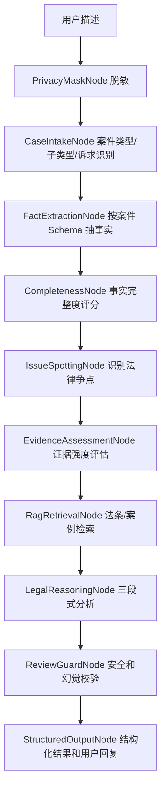

# 案件分析 Agent 架构设计

## 目标
把“固定模板输出”升级为“基于事实、争点、证据和规则的动态分析”。MVP 仍可用规则引擎离线运行，后续可把每个节点替换为 LLM 或 RAG 增强节点。

## Pipeline


## 节点职责
- `CaseIntakeNode`：输出 `caseType`、`subType`、`claimGoals`，避免只用大类判断。
- `FactExtractionNode`：每类案件有独立 schema，例如劳动纠纷关注入职时间、工资标准、拖欠期间、劳动关系证据。
- `CompletenessNode`：按必备事实计算 `completenessScore`，低于阈值时优先追问。
- `IssueSpottingNode`：按案件类型生成争点，例如“是否能够证明劳动关系”“拖欠工资责任”“借贷合意是否成立”。
- `EvidenceAssessmentNode`：区分强证据和辅助证据，标记是否已出现线索。
- `LegalReasoningNode`：每个争点按“规则、事实、适用、结论”输出，禁止跳到绝对结论。
- `ReviewGuardNode`：检查免责声明、绝对化结论、无来源法条、诱导伪造证据等风险。

## 结构化输出
核心字段：

```json
{
  "caseType": "劳动纠纷",
  "subType": "拖欠工资",
  "claimGoals": ["确认劳动关系", "支付工资/赔偿"],
  "completenessScore": 0.6,
  "conclusionLevel": "preliminary_possible",
  "facts": {},
  "missingQuestions": [],
  "issues": [
    {
      "issue": "是否能够证明劳动关系",
      "knownFacts": ["用人单位主体", "工资或管理关系"],
      "missingFacts": ["劳动关系证据"],
      "evidenceStrength": "medium",
      "legalRule": "劳动关系需结合用工管理、劳动报酬、工作内容等事实综合判断。",
      "application": "若能提供工资流水、考勤、工作群、社保或录用材料，劳动关系证明力会明显增强。",
      "conclusion": "该争点存在可主张方向，但证据链仍需补强。"
    }
  ],
  "evidenceAssessments": []
}
```

## 准确性策略
- 先追问，后判断：事实完整度低时不输出强结论。
- 多轮累积：同一会话内只汇总用户陈述，不把 Agent 自己的回复当事实；用户补充材料后重新计算完整度、争点和证据强度。
- 争点拆解：把一个案件拆成多个可验证争点。
- 证据分层：强证据、辅助证据、缺失证据分别标注。
- 结论分级：`needs_more_facts`、`preliminary_possible`、`preliminary_supported`。
- 来源约束：RAG 返回的法条/案例必须带来源；无来源时只做一般性提示。
- 安全边界：不承诺胜诉，不冒充律师，不指导伪造证据。
