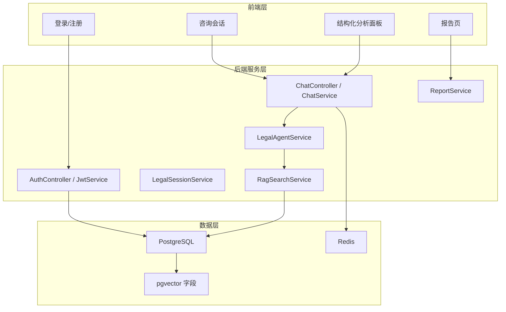
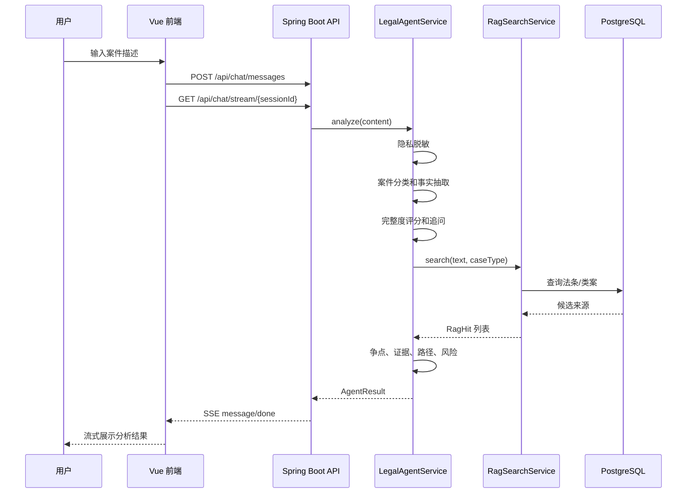

# 系统架构与 Agent 流程

## 1. 架构目标

本系统的目标不是做一个静态法律问答页面，而是构建一个有状态、有边界、可扩展的法律责任初步分析 Agent。它围绕“事实 -> 争点 -> 证据 -> 规则 -> 风险 -> 报告”的链路组织代码，让用户描述能够被转化为可复用的结构化分析。

## 2. 分层架构

## 3. Agent 核心闭环

## 4. 关键设计

### 4.1 可解释输出

Agent 不只返回一段自然语言，而是同时保存结构化结果。这样前端可以展示分析面板，报告服务可以复用同一份数据，测试也能直接断言案件类型、证据强度和缺失问题。

### 4.2 先追问后判断

当事实完整度不足时，系统优先给出缺失信息问题，例如入职时间、拖欠月份、借款交付时间、对方身份信息等。这样可以减少过早给出强结论的风险。

### 4.3 轻量 RAG 与扩展点

当前版本使用 PostgreSQL 中的法条和类案种子数据进行关键词检索，表结构已经预留 `embedding vector(1536)`。后续接入 embedding 后，可以升级为关键词召回 + 向量召回 + 重排的 Agentic RAG。

### 4.4 安全与合规

- `PrivacyMaskService` 在分析前处理身份证、手机号、银行卡等敏感信息。
- `LegalAgentService` 在回复开头统一加入免责声明。
- 风险提示模块识别时效、证据灭失、对方失联、财产转移等风险。
- 输出禁止承诺胜诉、指导伪造证据或绕开法律程序。

## 5. 可扩展方向

- 将案件分类、事实抽取、法律推理节点替换为 LLM Function Calling。
- 将 `prompt_templates` 接入后台，实现 Prompt 动态管理。
- 为 `model_call_logs` 加入 token、延迟、错误记录，形成 LLMOps 可观测性。
- 为文件上传接入 OCR、PDF/Word 解析和证据要素抽取。
- 将报告导出从 Markdown 升级为 PDF/Docx。
