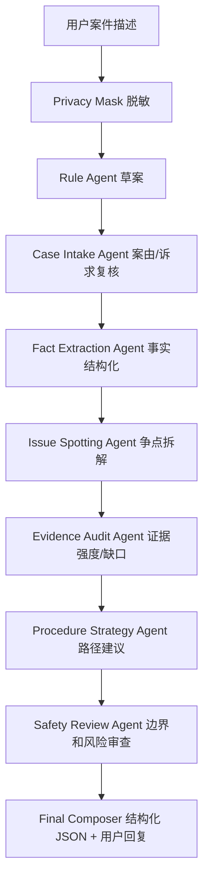

# Multi-Agent LLM Integration

## 目标

把当前规则 Agent 升级为“规则草案 + LLM 多 Agent 复核”的架构。规则层负责稳定、可解释、可回归的基础判断；LLM 层负责补强事实抽取、争点展开、证据缺口、程序路径和风险审查。

系统仍保持法律边界：

- 所有输出必须包含“仅供初步参考”。
- 不冒充律师、法院或司法机关。
- 不承诺胜诉或确定结果。
- 不指导伪造、篡改、隐匿证据。
- 事实不足时优先追问，不输出强结论。

## 协同架构



MVP 为了降低延迟和成本，demo 后端目前用“一次 OpenAI-compatible Chat Completions 调用”模拟上述虚拟 Agent 团队，返回 JSON patch 后合并到规则草案。

## 为什么不是直接让 LLM 回答

直接让模型回答容易出现三个问题：

- 案由飘移：用户补充事实后，模型可能忘记前文或切换法律关系。
- 结论过强：信息不足时给出过度确定的判断。
- 难以回归：改 prompt 后很难判断是否退化。

所以当前采用分层策略：

1. 规则 Agent 先产出 `caseType`、`facts`、`missingQuestions`、`issues`、`evidenceAssessments`、`actionPath`、`riskWarnings`。
2. LLM 只拿“用户事实 + 规则草案”做复核和增强。
3. LLM 必须返回 JSON，不允许自由格式长文。
4. 调用失败或超时，自动回退规则 Agent。

## API Key 配置

不要把 API Key 写进代码。用 PowerShell 环境变量启动 demo：

```powershell
cd E:\Data\PythonLearnFile\LawAgent
$env:LLM_PROVIDER="openai"
$env:LLM_API_KEY="你的_API_KEY"
$env:LLM_MODEL="gpt-4o-mini"
powershell.exe -ExecutionPolicy Bypass -File .\demo\run-demo.ps1
```

DeepSeek 兼容配置：

```powershell
$env:LLM_PROVIDER="deepseek"
$env:LLM_API_KEY="你的_DeepSeek_Key"
$env:LLM_MODEL="deepseek-chat"
powershell.exe -ExecutionPolicy Bypass -File .\demo\run-demo.ps1
```

通义千问兼容配置：

```powershell
$env:LLM_PROVIDER="qwen"
$env:LLM_API_KEY="你的_通义_Key"
$env:LLM_MODEL="qwen-plus"
powershell.exe -ExecutionPolicy Bypass -File .\demo\run-demo.ps1
```

自定义 OpenAI-compatible base URL：

```powershell
$env:LLM_PROVIDER="openai"
$env:LLM_BASE_URL="https://你的网关/v1"
$env:LLM_API_KEY="你的_API_KEY"
$env:LLM_MODEL="你的模型名"
powershell.exe -ExecutionPolicy Bypass -File .\demo\run-demo.ps1
```

启动后打开 `http://localhost:5173`，页面顶部应显示：

```text
rule-agent + llm-multi-agent-review / LLM：openai
```

## 输出 JSON 合并策略

LLM 可以增强这些字段：

- `caseType`
- `subType`
- `conclusionLevel`
- `missingQuestions`
- `issues`
- `evidenceAssessments`
- `actionPath`
- `riskWarnings`
- `citations`
- `userReply`

规则层仍保留原始草案，LLM 失败时不会影响主流程。

## 后续增强

- 把 RAG 检索结果也传给 LLM，要求每个法律规则绑定来源。
- 增加模型调用日志表，记录 provider、model、耗时、token、失败原因和脱敏后的输入摘要。
- 增加多轮事实记忆，区分用户事实、Agent 推论和证据材料。
- 对高风险输出增加第二次 Safety Review。
- 为四类案件分别维护 JSON Schema 和 prompt 模板。
