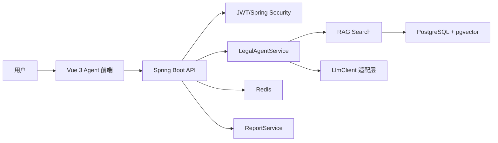
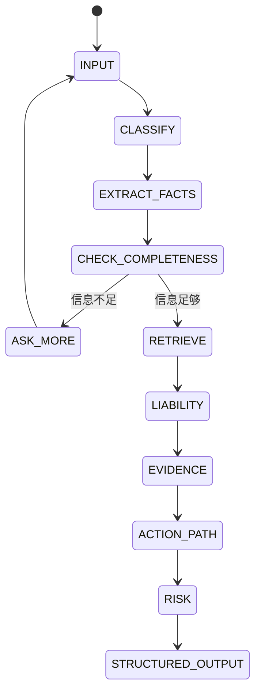

# 法律责任初步分析 Agent 技术方案

## 项目定位
本系统是面向普通用户的法律权益维护助手，不是 AI 法官，也不替代律师正式法律意见。MVP 聚焦劳动纠纷、房屋租赁、民间借贷、消费维权四类高频民事场景，提供多轮追问、事实结构化、初步责任分析、证据清单、维权路径、风险提示和报告生成。

## 总体架构

## MVP 模块
- 用户认证：注册、登录、JWT 鉴权、管理员接口权限预留。
- 法律聊天：会话列表、消息存储、SSE 流式回复。
- Agent 分析：案件分类、事实抽取、缺失信息追问、证据清单、责任分析、维权路径、风险提示。
- LLM 适配：`LlmClient` 已预留 mock、OpenAI、DeepSeek、通义千问等 provider 接入位置，MVP 默认使用规则分析。
- RAG：MVP 先用法条/案例表做关键词式候选召回，表结构已预留 `vector(1536)`，后续接 embedding 后改为混合检索。
- 报告：基于最新 `case_analyses` 生成 Markdown 格式《法律责任初步分析报告》。
- 文件上传：MVP 记录上传元数据，后续接 OCR、PDF/Word 解析和证据要素抽取。

## Agent 状态机

## RAG 流程
1. 法条、案例、文档切片写入 PostgreSQL。
2. 生成 embedding 后写入 `embedding vector(1536)`。
3. 查询时先进行 Query 改写，再做关键词召回和向量召回。
4. 对召回结果重排，保留标题、来源 URL、摘要和分数。
5. Prompt 中要求模型只引用检索结果，不确定时明确说明。
6. 法条失效时将 `effective=false`，默认检索过滤失效法条。

## 安全合规
- 所有回答必须包含“仅供初步参考，不构成正式法律意见”。
- 禁止输出绝对胜诉、保证赔偿、规避法律、伪造证据、隐瞒事实等建议。
- 刑事、行政处罚、重大金额、婚姻继承等复杂高风险场景提示咨询律师。
- 身份证、手机号、银行卡等敏感信息在进入 Agent 前脱敏。

## 开发路线
1. 当前版本：可启动前后端骨架、规则 Agent、种子法条/案例、SSE、报告。
2. 下一版：接入真实 LLM、Prompt 模板动态加载、模型调用日志。
3. 第三版：接入 OCR/文档解析、embedding 生成、pgvector 混合检索。
4. 后续：律师转接、知识库后台审核、报告导出 PDF/Docx。
