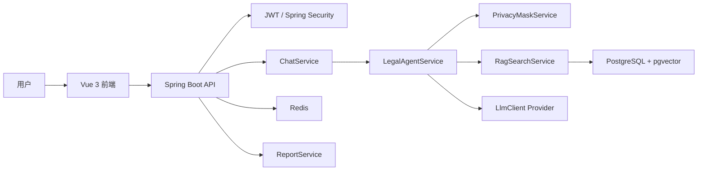

# CS599 项目规格文档

## 1. Product Spec

### 1.1 项目定位

法律责任初步分析 Agent 是一个面向普通用户的民事法律权益维护辅助系统。它不替代律师，不输出确定胜诉结论，而是帮助用户把零散描述整理为可分析的事实、争点、证据和行动路径。

### 1.2 用户与场景

| 用户 | 典型场景 | 系统价值 |
| --- | --- | --- |
| 劳动者 | 欠薪、未签劳动合同、辞退 | 整理仲裁事实、证据和风险 |
| 租客 | 押金不退、维修争议、提前退租 | 梳理合同条款、交接证据和返还请求 |
| 出借人 | 借款不还、无借条但有转账 | 判断借贷合意、交付和身份信息缺口 |
| 消费者 | 商品质量、虚假宣传、拒绝退款 | 形成平台投诉、监管投诉或诉讼材料 |

### 1.3 核心需求

- 用户可以注册、登录并创建法律咨询会话。
- 用户可以用自然语言描述案件，系统以 SSE 形式流式返回分析。
- Agent 必须输出案件类型、子类型、诉求目标、事实完整度、缺失问题、争点分析、证据清单、建议路径、风险提示和参考来源。
- 系统必须在所有法律分析中展示免责声明。
- 系统必须避免硬编码真实 API Key，并支持 Mock LLM 与外部 LLM Provider 切换。
- 系统应支持基于法条和案例种子数据的轻量 RAG 检索，并预留 pgvector embedding 扩展。

### 1.4 非目标

- 不提供正式法律意见。
- 不承诺诉讼结果。
- 不支持伪造证据、规避法律责任或隐瞒事实。
- 当前 MVP 不实现完整 OCR、PDF/Word 内容解析和在线律师转接。

## 2. Architecture Spec

### 2.1 总体架构



### 2.2 Agent 规格

Agent 采用可替换节点式编排。当前版本以 Java 服务中的规则节点实现，后续可以把单个节点替换为 LLM、RAG 或工具调用。

| 节点 | 输入 | 输出 |
| --- | --- | --- |
| PrivacyMask | 用户原始文本 | 脱敏文本 |
| CaseIntake | 脱敏文本 | 案件类型、子类型、诉求目标 |
| FactExtraction | 案件类型和文本 | 结构化事实 |
| Completeness | 结构化事实 | 完整度评分、缺失字段 |
| IssueSpotting | 事实和案件类型 | 法律争点列表 |
| EvidenceAssessment | 事实和证据规则 | 已有证据、待补证据 |
| RagRetrieval | 文本和案件类型 | 法条/案例候选来源 |
| LegalReasoning | 事实、争点、证据、来源 | 初步责任分析 |
| ReviewGuard | 分析结果 | 免责声明、安全边界、风险提示 |
| StructuredOutput | 完整 Agent 状态 | 用户回复和报告数据 |

### 2.3 数据设计

| 表 | 用途 |
| --- | --- |
| `users` | 用户账号、角色和登录身份 |
| `legal_sessions` | 用户法律咨询会话 |
| `chat_messages` | 会话消息与 Agent 回复 |
| `case_analyses` | 最新结构化分析结果 |
| `legal_articles` | 法条知识，预留 `embedding vector(1536)` |
| `legal_cases` | 类案知识，预留 `embedding vector(1536)` |
| `analysis_reports` | Markdown 报告 |
| `prompt_templates` | 后续 LLM Prompt 管理 |
| `model_call_logs` | 后续模型调用可观测性 |
| `privacy_mask_logs` | 后续脱敏审计 |

## 3. API Spec

统一响应结构：

```json
{ "code": 0, "message": "ok", "data": {} }
```

### 3.1 Auth

- `POST /api/auth/register`
- `POST /api/auth/login`

### 3.2 Legal Session

- `POST /api/legal-sessions`
- `GET /api/legal-sessions`
- `GET /api/legal-sessions/{id}`
- `PATCH /api/legal-sessions/{id}`
- `DELETE /api/legal-sessions/{id}`

### 3.3 Chat and Agent

- `POST /api/chat/messages`
- `GET /api/chat/stream/{sessionId}?content=...&access_token=...`
- `GET /api/case-analyses/{sessionId}`

### 3.4 Report

- `POST /api/reports/{sessionId}`
- `GET /api/reports/{id}/download`

### 3.5 Knowledge and Admin

- `GET /api/legal-articles/{id}`
- `GET /api/legal-cases/similar?caseType=劳动纠纷`
- `GET|POST|PUT /api/admin/prompt-templates`

## 4. SDD 核心设计

### 4.1 AgentResult

Agent 输出以结构化对象为核心，前端和报告服务都复用同一份数据：

```json
{
  "caseType": "劳动纠纷",
  "subType": "拖欠工资 + 未签劳动合同",
  "claimGoals": ["确认劳动关系", "支付工资/赔偿"],
  "completenessScore": 0.6,
  "conclusionLevel": "preliminary_possible",
  "facts": {},
  "missingQuestions": [],
  "issues": [],
  "evidenceAssessments": [],
  "actionPath": [],
  "risks": [],
  "citations": [],
  "userReply": "..."
}
```

### 4.2 状态与失败处理

- 输入为空或事实过少时，Agent 优先追问，不输出强结论。
- RAG 无结果时，Agent 仍可输出一般性分析，但会减少来源引用强度。
- 外部 LLM 未配置时，系统使用 Mock/规则分析，保证 Demo 可离线运行。
- 用户提交敏感信息时，脱敏服务先替换身份证、手机号、银行卡等信息。
- 高风险、复杂或金额较大的案件，Agent 输出律师咨询建议。

## 5. Acceptance Criteria

- README 可以让助教在 10 分钟内理解项目、启动项目并跑通 Demo。
- 报告覆盖课程要求七个评分章节。
- Docker Compose 或 Demo 脚本至少有一种方式可以启动展示。
- 后端测试覆盖两个代表性案例。
- 仓库不包含真实密钥、依赖目录和构建产物。
